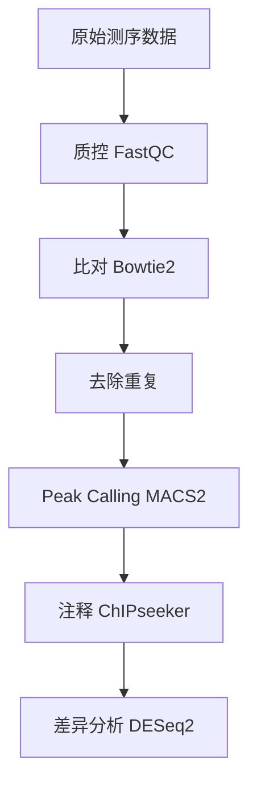
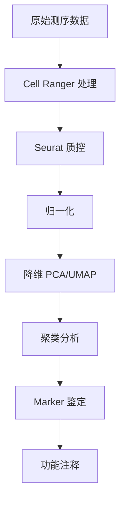

# 多组学知识图谱综合总结

*本页面由 llm-wiki 系统自动生成，综合所有实体知识形成全局视角*

---

## 核心洞察

### 组学技术的四维整合

本知识图谱涵盖四种互补的组学技术，从四个维度解析基因调控：

| 维度 | 技术 | 核心问题 | 关键方法 |
|------|------|---------|---------|
| **结合** | CUT&Tag | 转录因子在哪里结合？ | 抗体靶向 + 转座酶标记 |
| **开放** | ATAC-seq | 哪些区域是开放的？ | 转座酶可及性分析 |
| **状态** | scRNA-seq | 细胞的基因表达状态？ | 单细胞转录组测序 |
| **空间** | Hi-C | 基因组三维结构？ | 染色体构象捕获 |

**关键洞察**: 单一维度无法全面理解基因调控。例如，一个开放区域（ATAC-seq）如果被转录因子结合（CUT&Tag），且与靶基因在空间上接近（Hi-C），并在特定细胞类型中表达（scRNA-seq），这才是高置信度的调控关系。

---

## 分析流程概览

### ATAC-seq 流程



**核心工具链**: Bowtie2 → MACS2 → ChIPseeker

### scRNA-seq 流程



**核心工具链**: Cell Ranger → Seurat

---

## 关键技术对比

### 比对工具

| 工具 | 适用场景 | 优势 | 劣势 |
|------|---------|------|------|
| Bowtie2 | ATAC/ChIP-seq | 速度快、内存低 | 长reads支持一般 |
| STAR | RNA-seq | 剪接-aware | 内存占用大 |
| BWA-MEM | 通用 | 准确度高 | 速度较慢 |

**推荐**: ATAC/CUT&Tag 用 Bowtie2，RNA-seq 用 STAR

### Peak Calling

| 工具 | 最佳场景 | 特点 |
|------|---------|------|
| MACS2 | 标准 ChIP/ATAC | 最流行、参数丰富 |
| HOMER | 组蛋白修饰 | motif分析集成 |
| Genrich | ATAC-seq | 考虑重复去除 |

**推荐**: 常规分析用 MACS2，需要 motif 分析用 HOMER

### 单细胞分析

| 工具 | 语言 | 特点 |
|------|------|------|
| Seurat | R | 最流行、生态完善 |
| Scanpy | Python | 与 scikit-learn 兼容 |
| Monocle | R | 轨迹分析专长 |

**推荐**: R 用户用 Seurat，Python 用户用 Scanpy

---

## 常见问题模式

### 1. 批次效应 (Batch Effect)

**症状**: 同一细胞类型在不同批次中聚类成不同簇

**解决方案**:
- 质控阶段: 严格过滤低质量细胞
- 标准化: 使用 SCTransform 或 Harmony
- 可视化: UMAP 前检查批次分布

**相关实体**: [批次效应](../issues/batch_effect.md)、[Seurat](../tools/seurat.md)

### 2. 比对率低

**症状**: Bowtie2 比对率 < 70%

**可能原因**:
- 接头未去除
- 参考基因组不匹配
- 样本污染

**解决方案**:
- 检查 FastQC 报告
- 使用 Trimmomatic 去除接头
- 确认物种参考基因组

**相关实体**: [Bowtie2](../tools/bowtie2.md)、[质控](../steps/quality_control.md)

### 3. Peak 太少

**症状**: MACS2 只找到少量 peaks

**可能原因**:
- 测序深度不足
- 信号太弱
- 参数设置过严

**解决方案**:
- 增加测序深度（推荐 20M+ reads）
- 检查 IgG 对照
- 调整 MACS2 q-value 阈值

**相关实体**: [MACS2](../tools/macs2.md)、[Peak Calling](../steps/peak_calling_step.md)

---

## 交叉引用网络

### 技术组合策略

#### 策略 1: CUT&Tag + ATAC-seq

**目的**: 识别功能性调控元件

**逻辑**:
1. ATAC-seq 找到所有开放区域
2. CUT&Tag 确定哪些开放区域被转录因子结合
3. 交集 = 高置信度调控元件

**输出**: 候选增强子/启动子列表

#### 策略 2: scRNA-seq + scATAC-seq

**目的**: 单细胞多组学整合

**逻辑**:
1. scRNA-seq 定义细胞类型（基于表达）
2. scATAC-seq 定义细胞类型（基于染色质状态）
3. 联合分析揭示调控网络

**工具**: Seurat WNN (Weighted Nearest Neighbor)

#### 策略 3: Hi-C + 其他

**目的**: 验证远端调控关系

**逻辑**:
1. 发现 enhancer-promoter 互作
2. 验证 ATAC peaks 与靶基因的关联
3. 理解三维基因组约束

---

## 最佳实践总结

### 质控检查清单

- [ ] FastQC 通过（质量 > Q30）
- [ ] 比对率 > 70%
- [ ] 重复率 < 50%
- [ ] 峰数合理（ATAC: 50k-100k, ChIP: 5k-50k）
- [ ] 无基因组污染

### 分析参数建议

**Bowtie2**:
```bash
-X 1000 --very-sensitive
```

**MACS2**:
```bash
-q 0.05 --nomodel --extsize 200
```

**Seurat 聚类**:
```r
resolution = 0.8  # 起始值，根据数据调整
```

---

## 待深入研究

基于当前知识图谱，以下方向值得进一步探索：

### 技术前沿

- [ ] **单细胞 CUT&Tag (scCUT&Tag)**: 在单细胞水平研究 TF 结合
- [ ] **空间转录组 (Visium)**: 结合空间信息分析基因表达
- [ ] **多组学整合算法**: MOFA、Seurat WNN、TotalVI

### 分析方法

- [ ] **批次效应校正高级方法**: Harmony、scVI、Scanorama
- [ ] **细胞通讯分析**: CellChat、CellPhoneDB
- [ ] **轨迹推断**: Monocle3、PAGA、scVelo

### 应用场景

- [ ] **疾病机制研究**: 整合 GWAS + 多组学
- [ ] **药物靶点发现**: 基于调控网络的靶点预测
- [ ] **进化分析**: 跨物种调控元件比较

---

## 知识图谱统计

- 总实体数: 27
- 关系数: 37
- 实验类型: 2
- 分析工具: 4
- 分析步骤: 10+
- 关键概念: 5+

---

## 如何使用本综合

作为 LLM，当你需要：

1. **回答跨实体问题**: 查阅本页面获取全局视角
2. **推荐工具/方法**: 参考"关键技术对比"章节
3. **解决问题**: 查看"常见问题模式"
4. **设计实验**: 参考"技术组合策略"

---

*本综合页面由 llm-wiki 系统自动维护，定期更新以反映知识库演进*
